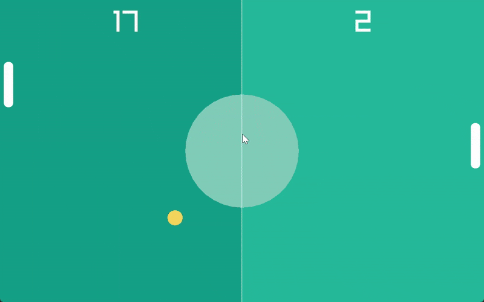

# Pong Game in C++ with Raylib

A simple **Pong game** built in **C++** using **Object-Oriented Programming (OOP) concepts** and the **Raylib library**. This project features a playable game against a CPU paddle with smooth controls, scoring, and collision detection.

---

## 🎥 Demo



## 🕹️ Features

- Classic Pong gameplay with **player vs CPU**.
- **OOP design**: Classes for `Ball`, `Paddle`, and `CpuPaddle`.
- **Player controls**:
  - `Up Arrow` – Move paddle up
  - `Down Arrow` – Move paddle down
- **CPU AI paddle** automatically follows the ball.
- Ball collision detection with paddles and walls.
- Score tracking for player and CPU.
- Colorful and visually appealing **game window** using Raylib.
- **Reset ball** automatically when a point is scored.

---

## 🎨 Visuals

- Custom colors for ball, paddles, and background.
- Center circle and dividing line to mimic classic Pong.
- Dynamic text showing scores for both player and CPU.

---

## 🛠️ Technologies Used

- **Language:** C++
- **Library:** [Raylib](https://www.raylib.com/) – for graphics, window handling, and input
- **Concepts:** OOP (classes, inheritance, public/private/protected members)

---

## ⚡ Gameplay Mechanics

- `Ball` class handles:
  - Position, speed, radius
  - Movement and collision with screen edges
  - Resetting after a point is scored
- `Paddle` class (player):
  - Moves up/down using keyboard
  - Prevents moving outside the screen
- `CpuPaddle` class:
  - Inherits from `Paddle`
  - Tracks ball’s Y position to follow automatically

---

## 🚀 How to Run

1. **Install Raylib**  
   Follow installation instructions: [https://www.raylib.com/](https://www.raylib.com/)  

2. **Compile the game**  
   Example using g++:
   ```bash
   g++ -o pong main.cpp -lraylib -lopengl32 -lgdi32 -lwinmm
